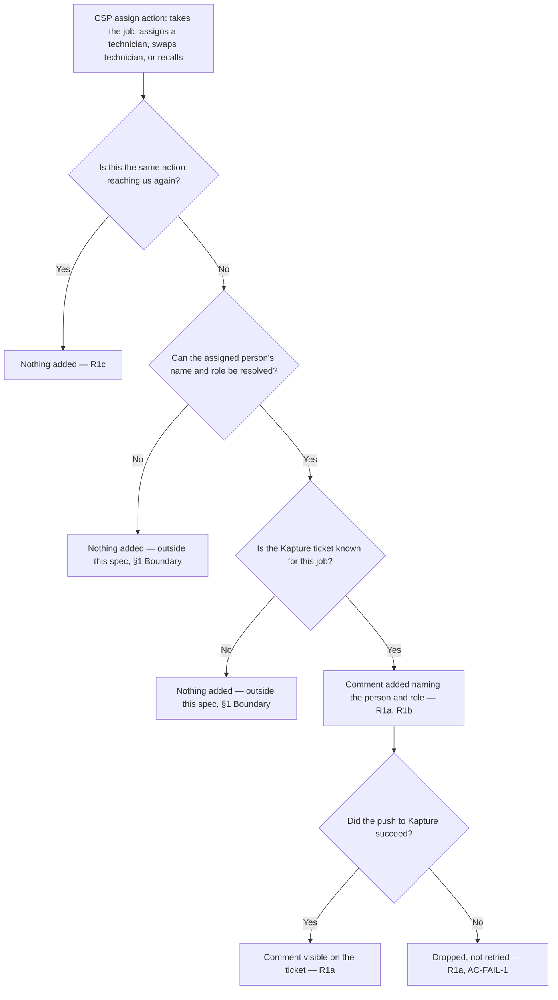

# Kapture Assignment Comment — telling the agent who is working

| | | | |
|---|---|---|---|
| **Owner** — Ashish Raj (PM) | **Reviewer** — [TBD — not asked] | **Status** — Draft | **Sign-off** — Pending |
| **Version** — v0.1 · 18 Sep 2026 | **Consulted — [TBD — not asked]** | **Consulted — [TBD — not asked]** | |

---

## 1. Objective & Guardrails

**Objective.** A call-centre agent taking a callback can tell the customer who is working on their ticket, without phoning the CSP to find out. ⚠️ *AI GENERATED — review*

**Boundary.** This spec governs a comment added to the Kapture ticket each time a CSP assigns someone to the job — himself, a technician, a different technician, or taking it back off one. It covers both task families, restore and shifting.

It leaves unchanged: how a ticket is created, classified, deadlined, resolved or closed; the ticket's status, sub-status, priority and queue, none of which this feature touches; the CleverTap notifications these same assignment events already drive; and the first-response stamping SRS already performs.

It also leaves unchanged the **blind window before anyone is assigned**. A restore ticket waits a median 131 minutes from reaching the CSP to the first response, and nothing is assigned during it — so on a callback in that window this feature gives the agent nothing new to say. Telling the agent that a ticket is still unclaimed is a separate problem and not solved here.

### Guardrails — promises that hold on every path

| ID | Guardrail | One line | Anchors |
|---|---|---|---|
| G1 | **The newest comment is the current person** | The most recent assignment comment on a ticket names whoever the latest assign action put on the job, so an agent reading down the thread ends on the truth. | R2a · AC-R2-1 · AC-GRD-1 |
| G2 | **One action, one comment** | Each assign action adds exactly one comment — never two for a single action, and never none because the person happens to be unchanged. | R1c · AC-DUP-1 · AC-GRD-2 |
| G3 | **Never a comment without an assignment** | A comment appears only where a CSP actually assigned someone. Nothing is written while a ticket sits unclaimed. | R1 MUST NOT (a) · AC-R1-6 · AC-GRD-3 |

---

## 2. Stories, Rules & Acceptance Criteria

### R1 — See who is working on it

| ID | Story | MUST | MUST NOT |
|---|---|---|---|
| R1 | As a call-centre agent handling a callback, I want the ticket to tell me who is working on it, so that I can answer the customer instead of phoning the CSP. | **(a)** Add a comment to the Kapture ticket on every assign action — the CSP taking the job himself, assigning a technician, swapping to a different technician, or recalling it off one. **(b)** Write the comment in one fixed form — `Job assigned — <name> (<role>)` — where role is `Partner` when the CSP took the job himself and `Technician` when he assigned one. The same form serves a first assignment, a swap and a recall. ⚠️ *AI GENERATED — review* **(c)** Add one comment per action: an action that reaches the system more than once — a double tap, a retry, a redelivered event — still adds one. **(d)** Do this for every service ticket, restore and shifting alike. | **(a)** Write anything while the ticket sits unclaimed. **(b)** Add two comments for one action. **(c)** Stay silent on a real action because the person assigned happens to be unchanged. |

| AC | Given / When / Then | Verifies | Status |
|---|---|---|---|
| AC-R1-1 | **Given** restore ticket `1789100000000000` with no assignment comment on it, **When** CSP Ramesh Kumar accepts the job at 09:31, **Then** one comment is added to that Kapture ticket reading `Job assigned — Ramesh Kumar (Partner)`. | R1a · R1b | Settled |
| AC-R1-2 | **Given** ticket `1789100000000000` carrying one comment naming Ramesh Kumar as CSP from 09:31, **When** Ramesh assigns technician Imran Sheikh at 09:48, **Then** a further comment is added reading `Job assigned — Imran Sheikh (Technician)`. | R1a · R1b | Settled |
| AC-R1-3 | **Given** ticket `1789100000000000` with Imran named on the newest comment, **When** Ramesh swaps the job to technician Vikas Yadav at 11:02, **Then** a further comment is added reading `Job assigned — Vikas Yadav (Technician)`. | R1a | Settled |
| AC-R1-4 | **Given** ticket `1789100000000000` with Imran named on the newest comment, **When** Ramesh recalls the job off Imran at 11:02 and takes it himself, **Then** a further comment is added reading `Job assigned — Ramesh Kumar (Partner)`. | R1a · R1b | Settled |
| AC-R1-5 | **Given** shifting ticket `1789100000000001` with no assignment comment on it, **When** Ramesh assigns technician Imran Sheikh to it at 09:48, **Then** a comment is added reading `Job assigned — Imran Sheikh (Technician)` — the same form as on a restore ticket. | R1d | Settled |
| AC-R1-6 | **Given** ticket `1789100000000000` open and unclaimed since 09:14, **When** two hours pass with no CSP action, **Then** no assignment comment exists on that Kapture ticket. | R1 MUST NOT (a) · G3 | Settled |
| AC-R1-7 | **Given** Imran was named on a comment at 09:31, **When** Ramesh assigns Imran again at 11:40 as a fresh action, **Then** a further comment naming Imran is added — an unchanged person is not a reason for silence. | R1c · R1 MUST NOT (c) | Settled |
| AC-R1-8 | **Given** ticket `1789100000000000` already resolved in Kapture at 12:15, **When** an assign action from 12:14 reaches this feature at 12:18, **Then** the comment is still added to the ticket. ⚠️ *AI GENERATED — review* | R1a | Settled |

### R2 — Trust the newest comment

| ID | Story | MUST | MUST NOT |
|---|---|---|---|
| R2 | As a call-centre agent, I want the newest comment to be the current truth, so that I never give a customer a name that has already been replaced. | **(a)** Name, in each comment, the person that comment's own action assigned — so the newest comment on the ticket is the current assignee. | Name anyone other than the person that action assigned. |

| AC | Given / When / Then | Verifies | Status |
|---|---|---|---|
| AC-R2-1 | **Given** ticket `1789100000000000` carrying comments naming Imran Sheikh at 09:48 then Vikas Yadav at 11:02, **When** agent Priya Nair opens the ticket at 11:30, **Then** the newest assignment comment names Vikas Yadav. | R2a · G1 | Settled |
| AC-R2-2 | **Given** the swap to Vikas Yadav at 11:02, **When** its comment is added, **Then** that comment reads `Job assigned — Vikas Yadav (Technician)` and names neither Ramesh Kumar nor Imran Sheikh. | R2 MUST NOT | Settled |

---

## 3. System Behaviour

### 3a. System flow chart

**Precedence:** none. Each assign action is handled on its own and nothing here competes with anything else for the same ticket.

### 3b. State transition table

No state management: behaviour is fully specified by §2 and the flow chart above.

---

## 4. Cross-cutting Acceptance Criteria

| AC | Given / When / Then | Verifies | Status |
|---|---|---|---|
| AC-WF-1 | **Given** restore ticket `1789100000000000` reaching the CSP at 09:14, **When** Ramesh accepts at 09:31, assigns Imran at 09:48, swaps to Vikas at 11:02, and resolves at 12:15, **Then** the Kapture ticket carries three assignment comments in that order — Ramesh as CSP, Imran as technician, Vikas as technician — the resolution adds none, and the newest names Vikas. | R1a · R2a · G1 · G2 | Settled |
| AC-WF-2 | **Given** ticket `1789100000000000` reaching the CSP at 09:14, **When** Ramesh accepts at 09:31 and resolves at 09:33, **Then** the ticket carries one assignment comment naming Ramesh, added before the resolution. | R1a | Settled |
| AC-FAIL-1 | **Given** Ramesh assigns Imran at 09:48 and the push to Kapture fails, **When** the failure occurs, **Then** no comment appears on the ticket, no further attempt is made, and the ticket reads exactly as it did at 09:47. | R1a | Settled |
| AC-FAIL-2 | **Given** the failed push from AC-FAIL-1, **When** Ramesh swaps to Vikas at 11:02, **Then** a comment naming Vikas is added — an earlier failure never stops a later action being written. | R1a · G2 | Settled |
| AC-REG-1 | **Given** Ramesh assigns Imran to ticket `1789100000000000`, **When** the assignment happens, **Then** the CleverTap events `restore_task_accepted` and `restore_technician_assigned` fire exactly as they do today, unchanged in payload and timing (§6). | §1 Boundary | Settled |
| AC-REG-2 | **Given** ticket `1789100000000000` with no prior CSP action, **When** Ramesh accepts it at 09:31, **Then** `complaint_tasks.first_response_at` is stamped 09:31 exactly as it is today (§6). | §1 Boundary | Settled |
| AC-REG-3 | **Given** ticket `1789100000000000` at status OPEN on the Partner queue with priority LOW, **When** any assignment comment is added, **Then** its status, sub-status, priority and queue are unchanged (§6). | §1 Boundary | Settled |
| AC-GRD-1 | **Given** every ticket that received two or more assignment comments over a full day of live traffic, **When** the release tester compares each ticket's newest comment against the last assign action recorded on that job, **Then** the two name the same person on every ticket. | G1 · R2a | Settled |
| AC-GRD-2 | **Given** every assign action recorded over a full day of live traffic, **When** the release tester counts the assignment comments on each ticket, **Then** each action accounts for exactly one comment. | G2 · R1c | Settled |
| AC-GRD-3 | **Given** every assignment comment added over a full day of live traffic, **When** the release tester traces each back to its job, **Then** each has an assign action behind it and none sits on a ticket that was never claimed. | G3 | Settled |
| AC-DUP-1 | **Given** Ramesh taps assign-Imran once at 09:48:00, **When** that single action reaches the system five times within ten seconds, **Then** exactly one comment naming Imran exists on the Kapture ticket. | R1c · R1 MUST NOT (b) · G2 | Settled |

---

## 5. Configurability

**This feature has no parameters.** Nothing in it is a clock, a limit or a threshold: a comment is added on an action, or it is not. Delivery carries no window — see `## Overrides`.

---

## 6. Impacted Systems & References

| System / Service | Impact | Reference material | What was checked · ACs grounded on it |
|---|---|---|---|
| csp-tas-service (restore module) | Must publish the assign action outward with the Kapture ticket on it. Emits `EsRestoreTaskAccepted`, `EsRestoreTechnicianAssigned` and `EsRestoreTaskRecalled` today. | `restore/domain/event/outbound/*.java` | Only `EsRestoreTechnicianAssigned` carries `ticketId`; the accepted and recalled events carry none, and no event is emitted for a technician swap that reaches SRS. Those gaps must close for R1a · AC-R1-1 · AC-R1-3 · AC-R1-4 |
| csp-support-resolution-service (SRS) | Must receive the assign action and pass it on. Eleven inbound event endpoints today. | `api/InboundEventController.java`; `domain/event/inbound/EsRestoreFirstResponseRecorded.java` | `ES_RESTORE_FIRST_RESPONSE_RECORDED` already arrives and stamps `first_response_at`, but it fires **once per job** and carries `triggering_action` with **no person** — so it cannot serve R1b or any later action · AC-REG-2 |
| ticket-service-java | New producer of an existing Kapture push. Must stay the only route to Kapture. | `util/KaptureQueueMessageKey.java`; `service/handler/impl/AddCommentHandler.java` | `ADD_COMMENT` already exists and takes `comment`, `ticket_id` and `sub_status`; passing `sub_status` empty leaves the ticket's sub-status untouched · AC-R1-1 · AC-REG-3 |
| Kapture | Receives the comment on the ticket thread. Status, sub-status, priority and queue must stay untouched. | Existing `ADD_COMMENT` integration, above | The push writes a comment only when `sub_status` is empty · AC-REG-3 |
| csp-notification-service | Must stay unchanged. Today the only consumer of the assign events, turning them into CleverTap events. | `inbound/InboundEventController.java`; `translate/EventTranslator.java` | Consumes `ES_RESTORE_TASK_ACCEPTED` and `ES_RESTORE_TECHNICIAN_ASSIGNED` and emits `restore_task_accepted` / `restore_technician_assigned`; adding a second consumer must not alter this · AC-REG-1 |
| Gateway CSP user record | Read for the assignee's name and role. | `CSP_USER` — id, role, first name, last name, phone | All 3,180 technicians carry a name and number, and 19,698 of 19,698 assigned jobs over 30 days resolve to both · AC-R1-1 · AC-R1-2 |

---

## 7. Glossary

| Term | Meaning | Owner (domain) |
|---|---|---|
| Assignee | The person a CSP has put on the job — either the CSP himself, or a technician he assigned. One at a time per ticket. | CSP execution |
| Assign action | Any CSP action that sets or changes the assignee: taking the job himself, assigning a technician, swapping to a different technician, or recalling it off one. | CSP execution |
| Assignment comment | The comment this feature adds to a Kapture ticket, naming the assignee and their role. The only thing this feature writes anywhere. | — |
| Call-centre agent | The person handling a customer call in Kapture. Reads the ticket; does not work the job. | Support/Ops |
| Partner | What a CSP is called on the Kapture side, and the only word for them the comment uses. The rest of this document says CSP, which is the word the CSP-side services use. The two are the same person; the comment uses the agent's word on purpose. | Support/Ops |
| Kapture | The CRM the call centre works in. Holds the ticket the customer's complaint was raised as, its status, queue and comment thread. | Support/Ops |
| Task family | Whether a job is a restore (a fault to fix) or a shifting (a connection to move). Both are service tickets and both are in scope. | CSP execution |
| Blind window | The stretch between a ticket reaching the CSP and the first assign action on it — a median 131 minutes, during which nobody is assigned and this feature writes nothing. | — |
| csp-tas-service | Holds the CSP-facing job and the actions taken on it. Source of every assign action. | CSP execution |
| csp-support-resolution-service | Owns the complaint record behind the ticket, its deadline and its closure. | CSP execution |
| ticket-service-java | The only route between Wiom's services and Kapture. Owns every push to it. | Support/Ops |
| csp-notification-service | Turns CSP-side events into app notifications. Reads the same assign events this feature needs. | CSP execution |

---

## 8. Notes for System Capabilities

What the platform must be able to do for this feature to exist. Whether these are one system or several, and how they interact, is the implementer's design.

| Capability | Needed by |
|---|---|
| Observe every assign action on a job — take, assign, swap, recall — and carry the Kapture ticket with each. Today only the technician-assignment event carries the ticket, and a swap reaches nothing downstream at all. | R1a · §6 csp-tas-service |
| Resolve an assignee's name and whether they are the CSP or a technician, from their identifier, at the moment the comment is written. | R1b · §6 Gateway CSP user record |
| Recognise one assign action reaching the system more than once, so a double tap or a retry writes a single comment — without mistaking two real actions for one. | R1c · G2 · AC-DUP-1 |
| Add a comment to a Kapture ticket without touching its status, sub-status, priority or queue. | R1a · AC-REG-3 |
| Do all of the above for a shifting job as well as a restore one. | R1d · AC-R1-5 |

---

## AI-generated content for review

| Location (section · ID) | What was generated | Basis |
|---|---|---|
| §1 · Objective | "without phoning the CSP to find out" | Put to you as a proposed objective and not corrected. The feature you described is the comment; the outcome behind it — the agent stops chasing — is inferred. |
| §2 · R1b | The comment's fixed wording, `Job assigned — <name> (<role>)`, and the choice of `Partner` over `CSP` | You said the comment must carry name and role, not what it should say. The form is mine. `Partner` is not: it is the word the Kapture-facing code uses 44 times, against zero for `CSP`. |
| §2 · AC-R1-8 | A comment whose action preceded closure is still added after the ticket is resolved in Kapture | You chose "every assignment comments" and said nothing about a ticket already closed. Adding keeps the record complete; the alternative is dropping it, which loses the trail. |

## Not asked

| Location (section · ID) | What was never asked |
|---|---|
| Header · Reviewer | Which engineering lead reviews this. |
| Header · Consulted | Which domains must be consulted — Support/Ops for the Kapture side, CSP execution for the event side. |

## Overrides

| Rule overridden | What was done instead | Rationale | Approved by |
|---|---|---|---|
| J2 — every moment where someone waits uninformed sits inside a §5 window with a stated outcome | The push is best effort. It is tried once, and a failure drops the comment with no window, no retry promise and no record (AC-FAIL-1). | PM decision: an agent-facing comment does not warrant the retry and recovery engineering a committed window would force. The cost is that a dropped comment is invisible — the agent simply sees nothing, and AC-GRD-3 cannot distinguish a dropped comment from an action that never happened. | Ashish Raj, 18 Sep 2026 |
